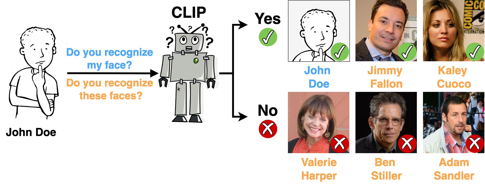
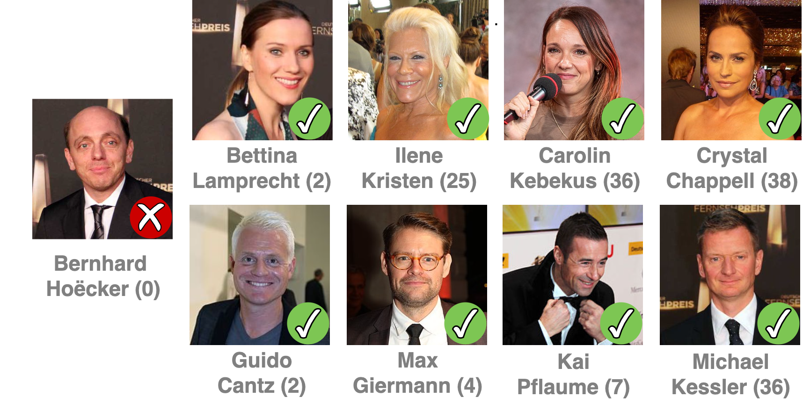
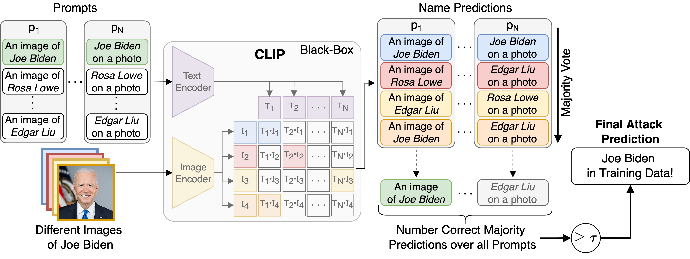

# Does CLIP Know My Face?

<p align="center">
    </br>
    <em>Illustration of our Identity Inference Attack (IDIA). True-positive (&#10003;) and true-negative (&#10007;) predictions of individuals to be part of the training data of CLIP. The IDIA was performed on a CLIP model trained on the Conceptual Captions 3M dataset where each person appeared only 75 times in a dataset with a total of 2.8 million image-text pairs. Celebrity images licensed as CC BY 2.0 (see <a href="#jimmy_fallon">Jimmy Fallon</a>, <a href="#kaley_cuoco">Kaley Cuoco</a>, <a href="#valerie_harper">Valerie Harper</a>, <a href="#ben_stiller">Ben Stiller</a>, <a href="#adam_sandler">Adam Sandler</a></em>
</p>

<p align="center">
    </br>
    <em>Identity Inference Attack Examples (IDIA) of infrequent appearing celebrities. True-positive (&#10003;) and true-negative (&#10007;) predictions of European and American celebrities in the LAION-400M dataset. The number in parentheses indicates how often the person appeared in the LAION dataset, containing 400 million image-text pairs. The IDIA was performed on different CLIP models trained on the LAION-400M dataset with the same prediction results. Images licensed as CC BY 3.0 and CC BY 2.0 (see <a href="#bernhard_hoecker">Bernhard Hoëcker</a>, <a href="#bettina_lamprecht">Bettina Lamprecht</a>, <a href="#ilene_kristen">Ilene Kristen</a>, <a href="#carolin_kebekus">Carolin Kebekus</a>, <a href="#crystal_chappell">Crystal Chappell</a>, <a href="#guido_cantz">Guido Cantz</a>, <a href="#max_giermann">Max Giermann</a>, <a href="#kai_pflaume">Kai Pflaume</a>, <a href="#michael_kessler">Michael Kessler</a>
    </em>
</p>

Abstract: _With the rise of deep learning in various applications, privacy concerns around the protection of training data have become a critical area of research. Whereas prior studies have focused on privacy risks in single-modal models, we introduce a novel method to assess privacy for multi-modal models, specifically vision-language models like CLIP. The proposed Identity Inference Attack (IDIA) reveals whether an individual was included in the training data by querying the model with images of the same person. Letting the model choose from a wide variety of possible text labels, the model reveals whether it recognizes the person and, therefore, was used for training. Our large-scale experiments on CLIP demonstrate that individuals used for training can be identified with very high accuracy. We confirm that the model has learned to associate names with depicted individuals, implying the existence of sensitive information that can be extracted by adversaries. Our results highlight the need for stronger privacy protection in large-scale models and suggest that IDIAs can be used to prove the unauthorized use of data for training and to enforce privacy laws._

[Arxiv](https://arxiv.org/abs/2209.07341) [PDF](https://arxiv.org/pdf/2209.07341.pdf)

## Identity Inference Attack (IDIA)

<p align="center">
    </br>
    <em>Identity Inference Attack (IDIA). Depiction of the workflow of our IDIA. Given different images and the name of a person, CLIP is queried with the images and multiple prompt templates containing possible names. After receiving the results of the queries, for each of the prompts, the name inferred for the majority of images is taken as the predicted name. If the number of correct predictions over all the prompts is greater or equal &#964;, the person is assumed to be in the training data. (Best Viewed in Color)</em>
</p>

## LAION-400M Experiments

This part describes everything needed to set up and run the experiments on the LAION-400M dataset.

### Download the LAION-400M Non-Members

The first step is to download the images of the individuals that are not present in the LAION-400M dataset. To do this, simply run the following script:

```bash
python laion400m_experiments/00_download_laion_european_non_members.py
```

### Run the Experiments

After all setup steps are done, the notebooks `01_analyze_laion400m.ipynb` and `02_idia_laion_multiprompt.ipynb` can be run.

## Conceptual Captions Experiments

This part describes everything needed to set up and run the experiments on the [Conceptual Captions 3M dataset](https://ai.google.com/research/ConceptualCaptions/). First, the dataset has to be downloaded from the [official website](https://ai.google.com/research/ConceptualCaptions/). Because failed image downloads sometimes produce empty files, the `00_filter_empty_files.ipynb`-notebook has to be used to remove all empty files for training the models.

### Creating the CC3M Index

Create an index using [clip-retrieval](https://github.com/rom1504/clip-retrieval). Then, we can start clip-retrieval in multiple docker containers:

```bash
for i in 0 1 2 3 4 5 6 7 8 9; do ./docker_run.sh -d "0" -m mounts.docker -n clip-retrieval${i}_gpu0; done
```

Then, we can run the clip-retrieval command in all those docker containers:

```bash
for i in 0 1 2 3 4 5 6 7 8 9; do docker exec -d clip-retrieval${i}_gpu0 clip-retrieval back --port 1337 --indices-paths configs/laion400m.json; done
```

### Downloading Pre-Trained CLIP Models

Before running the notebooks of the CC3M experiments, you first have to download the pre-trained models from the [GitHub release page](https://github.com/D0miH/does-clip-know-my-face/releases) and extract them to `cc3m_experiments/checkpoints`. Don't forget to unzip the ResNet-50x4 model files after moving them to the checkpoints folder.

### Download the ResNet-50 trained on FaceScrub

Download the pretrained ResNet-50 trained on FaceScrub `rn50_facescrub.ckpt` from the release page and extract it to `facescrub_training/pretrained_models/rn50_facescrub.ckpt`.

### Download the FaceScrub Image Embeddings

Download the image embeddings of the FaceScrub dataset calculated using the OpenAI CLIP model `openai_facescrub_embeddings.pt` and move the file to `embeddings/openai_facescrub.pt`

### Run the Experiments

After all setup steps are done, the notebooks can be run in the order following the numbering.

## Citation
If you build upon our work, please don't forget to cite us.
```
@article{hintersdorf22doesclipknowmyface,
  author = {Hintersdorf, Dominik and Struppek, Lukas and Brack, Manuel and Friedrich, Felix and Schramowski, Patrick and Kersting, Kristian},
  title = {Does CLIP Know my Face?},
  journal = {Journal of Artificial Intelligence Research (JAIR)},
  volume = {80},
  year = {2024},
  pages = {1033-1062}
}
```

## Image Credits
<a href="https://www.flickr.com/photos/montclairfilmfest/11046018105/" id="jimmy_fallon">Jimmy Fallon, by Montclair Film, 2013, cropped, CC BY 2.0</a></br> 
<a href="https://www.flickr.com/photos/therainstopped/3781595029/" id="kaley_cuoco">Kaley Cuoco, by MelodyJSandoval, 2009, cropped, CC BY 2.0</a></br> 
<a href="https://www.flickr.com/photos/38494596@N00/350140882/" id="valerie_harper">Valerie Harper, by Maggie, 2007, cropped, CC BY 2.0</a></br>
<a href="https://www.flickr.com/photos/montclairfilmfest/46998980874/" id="ben_stiller">Ben Stiller, by Montclair Film (Photography by Neil Grabowsky), 2019, cropped, CC BY 2.0</a></br>
<a href="https://commons.wikimedia.org/wiki/File:Adam_Sandler_on_%27Blended%27_Red_Carpet_in_Berlin_%2814043442427%29.jpg" id="adam_sandler">Adam Sandler, by Glyn Lowe Photo Works, 2014, cropped, CC BY 2.0</a></br> 

<a href="https://commons.wikimedia.org/wiki/File:Deutscher_Fernsehpreis_2012_-_Bernhard_Hoecker.jpg" id="bernhard_hoecker">Bernhard Hoëcker, by JCS, 2012, cropped, CC BY 3.0</a></br>
<a href="https://commons.wikimedia.org/wiki/File:Deutscher_Fernsehpreis_2012_-_Bettina_Lamprecht_-_Matthias_Matschke_2.jpg" id="bettina_lamprecht">Bettina Lamprecht, by JCS, 2012, cropped, CC BY 3.0</a></br>
<a href="https://www.flickr.com/photos/greginhollywood/14353837150/" id="ilene_kristen">Ilene Kristen, by Greg Hernandez, 2014, cropped, CC BY 2.0</a></br>
<a href="https://commons.wikimedia.org/wiki/File:Carolin_Kebekus-5848.jpg" id="carolin_kebekus">Carolin Kebekus, by Harald Krichel, 2019, cropped, CC BY 3.0</a></br>
<a href="https://www.flickr.com/photos/greginhollywood/4740979409/in/photostream/" id="crystal_chappell">Crystal Chappell, by Greg Hernandet, 2010, cropped, CC BY 2.0</a></br>
<a href="https://commons.wikimedia.org/wiki/File:Frankfurter_Buchmesse_2015_-_Guido_Cantz_1.JPG" id="guido_cantz">Guido Cantz, by JCS, 2015, cropped, CC BY 3.0</a></br>
<a href="https://commons.wikimedia.org/wiki/File:Hessischer_Filmpreis_2017_-_Max_Giermann_2.JPG" id="max_giermann">Max Giermann, by JCS, 2017, cropped, CC BY 3.0</a></br>
<a href="https://commons.wikimedia.org/wiki/File:Goldene_Kamera_2012_-_Kai_Pflaume.jpg" id="kai_pflaume">Kai Pflaume, by JCS, 2012, cropped, CC BY 3.0</a></br>
<a href="https://commons.wikimedia.org/wiki/File:Deutscher_Fernsehpreis_2012_-_Michael_Kessler.jpg" id="michael_kessler">Michael Kessler, by JCS, 2012, cropped, CC BY 3.0</a></br>

