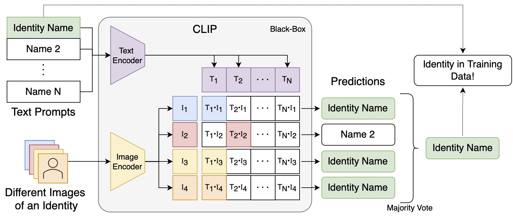

# CLIPping Privacy: Identity Inference Attacks on Multi-Modal Machine Learning Models

<p align="center">
    </br>
    <em>Identity Inference Attack Examples. True positive (green border) and true negative (red border) prediction examples
of our IDIA on a model trained on the LAION-400M dataset using cropped images of individuals from the FaceScrub Dataset (Ng and Winkler, ICIP 2014) and German
celebrities (<a href="https://commons.wikimedia.org/wiki/File:Goldene_Kamera_2012_-_Bastian_Pastewka_1.jpg">JCS, 2012</a>; <a href="https://commons.wikimedia.org/wiki/File:Goldene_Kamera_2012_-_Kai_Pflaume.jpg">JCS, 2013</a>)</em>
</p>

Abstract: _As deep learning is now used in many real-world applications, research has focused increasingly on the privacy of deep learning models and how to prevent attackers from obtaining sensitive information about the training data. However, image-text models like CLIP have not yet been looked at in the context of privacy attacks. While membership inference attacks aim to tell whether a specific data point was used for training, we introduce a new type of privacy attack, named identity inference attack (IDIA), designed for multi-modal image-text models like CLIP.
Using IDIAs, an attacker can reveal whether a particular person, was part of the training data by querying the model in a black-box fashion with different images of the same person. Letting the model choose from a wide variety of possible text labels, the attacker can probe the model whether it recognizes the person and, therefore, was used for training. Through several experiments on CLIP, we show that the attacker can identify individuals used for training with very high accuracy and that the model learns to connect the names with the depicted people. Our experiments show that a multi-modal image-text model indeed leaks sensitive information about its training data and, therefore, should be handled with care._

[Arxiv Preprint (PDF)](https://arxiv.org) TBA!

## Identity Inference Attack (IDIA)

<p align="center">
    </br>
    <em>Identity Inference Attacks. Depiction of the workflow of our IDIA. Given different images and the name of a
person, the adversary queries CLIP with the images and multiple possible names, including the name of the person. The
person is predicted to be in the training set if the name is correctly predicted for more than half the images.</em>
</p>

## Setting up the experiments

In the following detailed instructions on how to reproduce the experiments in the paper are given.

### LAION-400M Experiments

This part describes everything that is needed to setup and run the experiments on the LAION-400M dataset.

#### Downloading the LAION-400M Index

In order to efficiently search the dataset using [clip-retrieval](https://github.com/rom1504/clip-retrieval) we first need the index of the [LAION-400M dataset](https://laion.ai/blog/laion-400-open-dataset/). Download the index from the LAION-400M website using the following command **in the root of the project**:

```bash
wget --no-parent -R "index.html*" -r -nH --cut-dirs=3 https://deploy.laion.ai/8f83b608504d46bb81708ec86e912220/indices/index100/ -P data/laion400m_index100
```

After downloading the index, we can start clip-retrieval in multiple docker containers:

```bash
for i in 0 1 2 3 4 5 6 7 8 9; do ./docker_run.sh -d "0" -m mounts.docker -n clip-retrieval${i}_gpu0; done
```

Then we can run the clip-retrieval command in all those docker containers:

```bash
for i in 0 1 2 3 4 5 6 7 8 9; do docker exec -d clip-retrieval${i}_gpu0 clip-retrieval back --port 1337 --indices-paths configs/laion400m.json; done
```

#### Download the LAION-400M Non-Members

The next step is to download the images of the individuals that are not present in the LAION-400M dataset. To do this simply run the following script:

```bash
python laion400m_experiments/00_download_laion_german_non_members.py
```

#### Run the Experiments

After all setup steps are done the notebooks `01_analyze_laion400m.ipynb` and `02_openclip_clipping_privacy_faceescrub.ipynb` can be run.

### Conceptual Captions Experiments

This part describes everything that is needed to setup and run the experiments on the [Conceptual Captions 3M dataset](https://ai.google.com/research/ConceptualCaptions/). First the dataset has to be downloaded from the [official website](https://ai.google.com/research/ConceptualCaptions/). Because failed image download sometimes produce empty files, the `00_filter_empty_files.ipynb`-notebook has to be used to remove all empty files for training the models.

#### Downloading the CC3M Index

Download the `clip_retrieval_index.zip` file from the [release page](https://github.com/D0miH/clipping_privacy/releases) and unpack it into `./data/conceptual_captions/clip_retrieval_index`.
After downloading the index, we can start clip-retrieval in multiple docker containers:

```bash
for i in 0 1 2 3 4 5 6 7 8 9; do ./docker_run.sh -d "0" -m mounts.docker -n clip-retrieval${i}_gpu0; done
```

Then we can run the clip-retrieval command in all those docker containers:

```bash
for i in 0 1 2 3 4 5 6 7 8 9; do docker exec -d clip-retrieval${i}_gpu0 clip-retrieval back --port 1337 --indices-paths configs/laion400m.json; done
```

#### Downloading Pre-Trained CLIP Models

Before running the notebooks of the CC3M experiments you first have to download the pretrained models `checkpoints.zip` from the [GitHub release page](https://github.com/D0miH/clipping_privacy/releases) and extract it to `cc3m_experiments/`.

#### Download the ResNet-50 trained on FaceScrub

Download the pretrained ResNet-50 trained on FaceScrub `rn50_facescrub.ckpt` from the release page and extract it to `facescrub_training/pretrained_models/rn50_facescrub.ckpt`.

#### Download the FaceScrub Image Embeddings

Download the image embeddings of the FaceScrub dataset calculated using the OpenAI CLIP model `openai_facescrub_embeddings.pt` and move the file to `embeddings/openai_facescrub.pt`

#### Run the Experiments

After all setup steps are done, the notebooks can be run in the order following the numbering.
